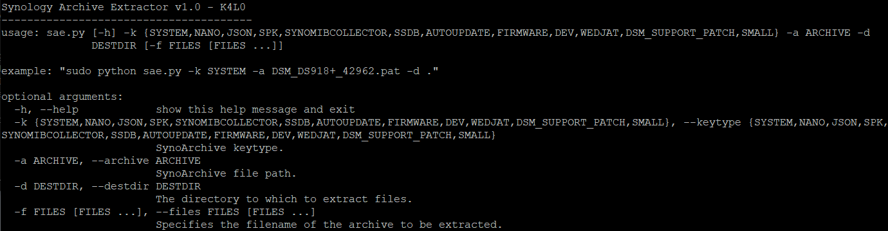
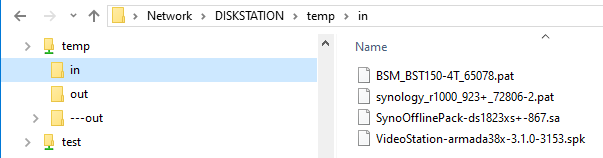
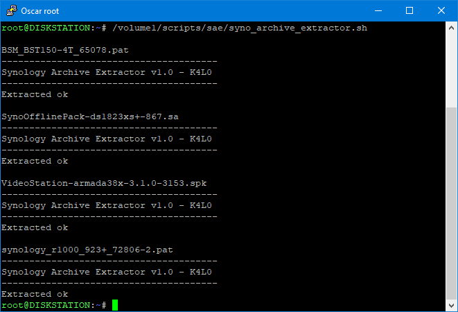
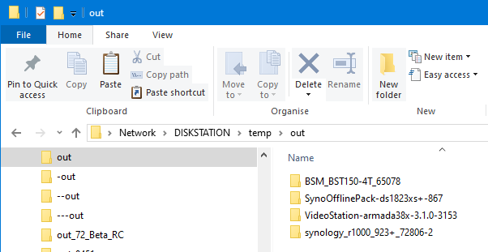
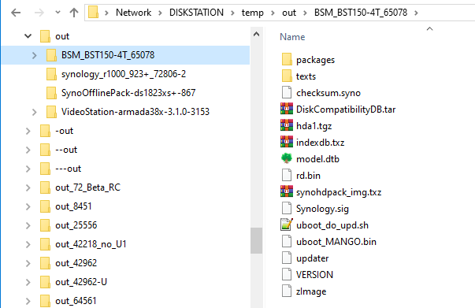
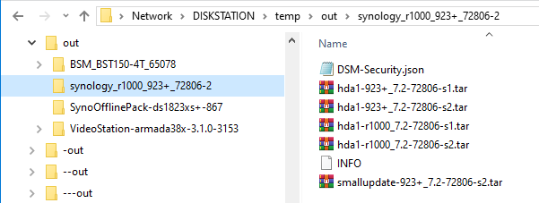
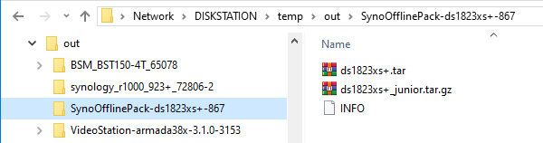
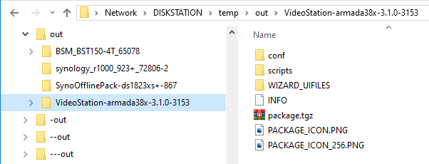

# Synology_Archive_Extractor

usage:
<p align="leftr"></p>

Supports all synoarchive types.

Run it on your own nas, with root privilege.

On x86 linux, the required libraries are located in /usr/lib:

```
libcrypto.so.1.1
libicudata.so.64
libicui18n.so.64
libicuuc.so.64
libmsgpackc.so.2
libsodium.so
libsynocodesign.so
libsynocore.so.7
libsynocredentials.so.7
libsynocrypto.so.7
```

<br>

In Windows WSL Ubuntu I needed more than just the above files:

```
libcredntials.so.7  <-- renamed copy of libsynocredentials.so.7
libcrypto.so.1.1
libcrypto.so.7      <-- renamed copy of libsynocrypto.so.7
libicudata.so.64
libicui18n.so.64
libicuuc.so.64
libmsgpackc.so.2
libsodium.so
libsynocodesign.so
libsynocodesign.so.7
libsynocore.so.7
libsynocredentials.so.7
libsynocrypto.so.7
libtss2-esys.so
libtss2-esys.so.0
libcodesign.so
libcore.so.7        <-- renamed copy of libsynocore.so.7
```

Instead of copying and renaming files I could have, and should have, created symlinks.

<br>

## Using the syno_archive_extractor.sh script to simplify things

You can run syno_archive_extractor.sh in 2 ways:
1. Via SSH as root or sudo
2. In task scheduler as a user defined script run by root.

Edit the 3 variables near the top of the script to suit your folder locations:

```bash
# Location of the folder containing the files to extract
inpath="/volume1/temp/in"

# Location of the folder extract to
outpath="/volume1/temp/out"

# Location of the sae.py script
pyscript="/volume1/scripts/sae/sae.py"
```

Now whenever you want to extract Synology DSM 7 files place the files to be extracted in the **in** folder
<p align="leftr"></p>

Run the syno_archive_extractor.sh bash script
<p align="leftr"></p>

The extracted files will be in their own folder in the **out** folder
<p align="leftr"></p>

Extracted BeeStation pat file
<p align="leftr"></p>

Extracted DSM 7.2.2 small update pat file
<p align="leftr"></p>

Extracted Synology drive database update
<p align="leftr"></p>

Extracted Synology package
<p align="leftr"></p>

<br>
